(红黑树)

平衡条件

1. 节点非红即黑
2. 头节点是黑色
3. 叶子结点（NIL）是黑色
4. 红色节点的双子节点是黑色
5. 从根节点到每个叶子节点的路径上，黑色节点数量相同

最短路径： 全黑节点 （n个黑）
最长路径： 红黑相间 （n个黑 n个红）
通过维护最短路径和最长路径是两倍关系 保持平衡

### 插入失衡情况：

1. 因为每次插入的节点都是红色（插入黑就会导致平衡条件5失效，所以一般都是插入红色），所以会出现两个红节点作为父子关系
2. 插入失衡处理方法： 插入调整需要看祖父节点，删除调整看父节点
    1. 当叔父节点为红色
       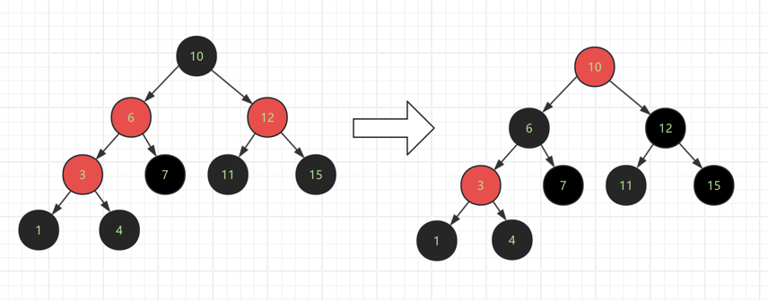
        1. 思路： 解决父子双红问题的同时，还要保证当前局部树中每条路径上黑色数量相同
        2. 方案： root节点变为红色 parent和uncle变为黑色， 最后将头节点变为黑
           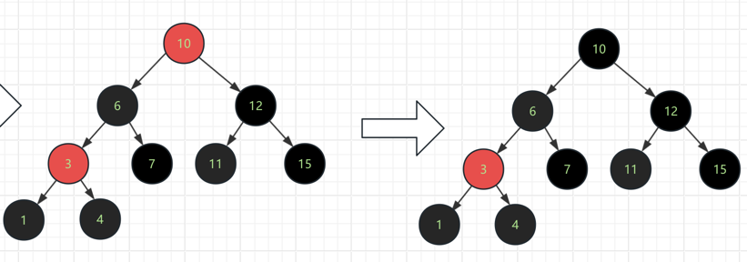
    2. 当叔父节点非红
        1. LL型
            1. 对祖父节点进行右旋
               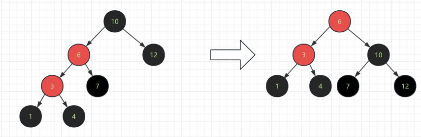
            2. 红色上浮或者红色下沉
                3. 红色上浮： 红黑黑
                4. 红色下沉： 黑红红
                   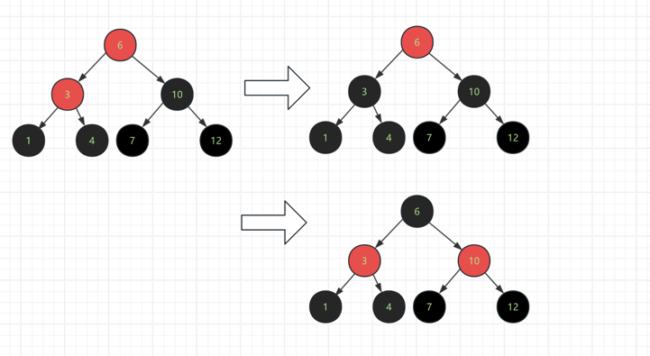
        2. LR型
            1. 对父节点左旋
               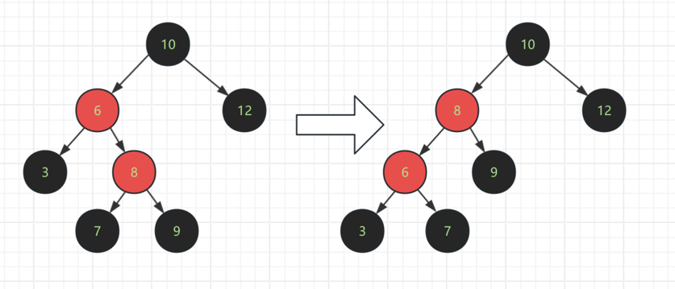
            2. 对祖父节点右旋
               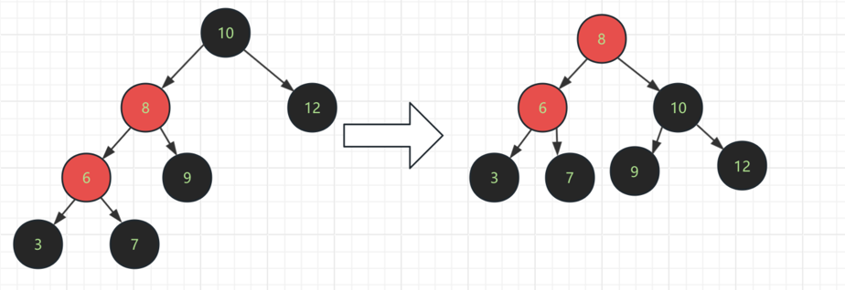
            3. 红色上浮或者红色下沉
               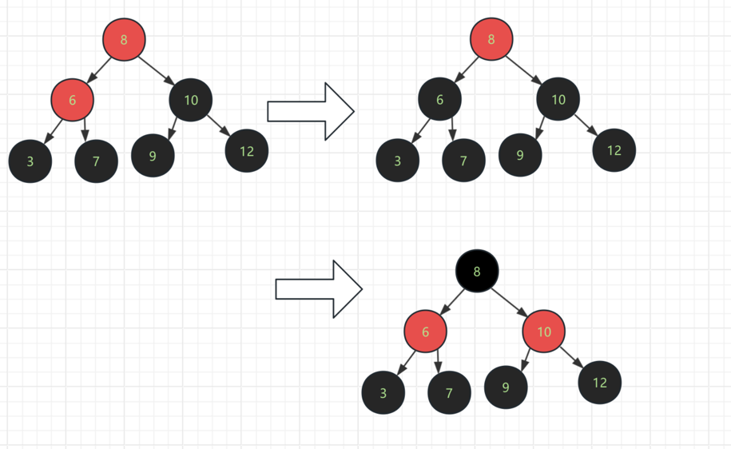
        3. RR型
            1. 对祖父节点进行左旋
            2. 红色上浮或者红色下沉
        4. RL型
            1. 对父节点右旋
            2. 对祖父节点左旋
            3. 红色上浮或者红色下沉

### 删除失衡调整

| 出度 /颜色 | 红                        | 黑                                                                             |
|--------|--------------------------|-------------------------------------------------------------------------------|
| 0      | 直接删除                     | 删除节点后，该节点位置的指针就会变为指向NIL空节点（NIL是黑色的），此时当前路径上就会少一个黑色节点数量。于是将NIL节点改为**_双重黑_**的颜色 |
| 1      | 情况不存在（红色节点如果有子节点肯定是两个黑色） | 黑色节点如果只有一个子节点，那么该子节点必定是红色，才能维持平衡条件五，此时只要上升子节点，并改为黑色即可                         |
| 2      | 找到前驱或者后继，转化为度为0或1的情况     | 找到前驱或者后继，转化为度为0或1的情况                                                          |

##### 解决双重黑节点

1. 兄弟节点是黑色
    1. 兄弟节点子节点没有红色 （此时只要将双重黑节点向上转移
       ，即父节点成为双重黑，右路径增加了一个黑，于是将兄弟节点变为红，减少一个黑，保持调整颜色前的黑色节点数量）
       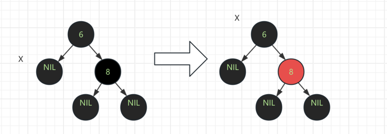
    2. 兄弟节点的子节点中有红色节点
        1. 兄弟节点同侧的子节点为红色（e.g. 双黑节点是左节点，那么兄弟节点在右边，兄弟节点的右子节点就是同侧）
           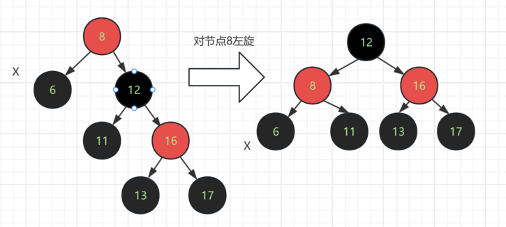
            1. 将双重黑的父节点进行大左旋
            2. 分析旋转后，各个节点是否是确定颜色（图中：6确定黑色， 12确定黑色， 16确定红色， 13，17确定黑色）
            3. 由于8的颜色不确定，分两种情况来分别判定
                1. 原根节点8原先是红色。 旋转后，可以将双重黑6的一个黑向上转移到节点8，此时新根节点8的左树路径上黑死节点变为3个。为了保持调整前后
                   黑色节点数相同，于是将新根节点12变为红色。但右树路径上少了一个黑，于是将红色节点16变为黑色。
                   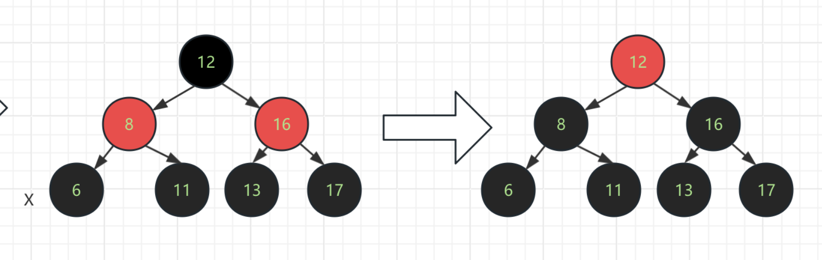
                2. 原根节点8为黑色。 旋转前，原根8到双黑6路径上有三个黑色节点，旋转后新根节点黑12到黑节点6上依旧保持三个黑色节点。
                    1. 旋转前，原根黑8到黑17路径上有三个黑色，旋转后新根黑12到黑17路径上变为了两个黑，所以将红16变为黑。
                    2. 总结： 原根为红色，调整后：新根为红，新根的左右子节点为黑；
                       原根为黑色，调整后，新根为黑，新根左右子节点为黑。
                       
                       为了代码实现方便，可以将两种情况统一为：新根的颜色变为原根的颜色，新根的子节点颜色变为黑
        2. 兄弟节点的非同侧子节点为红色
           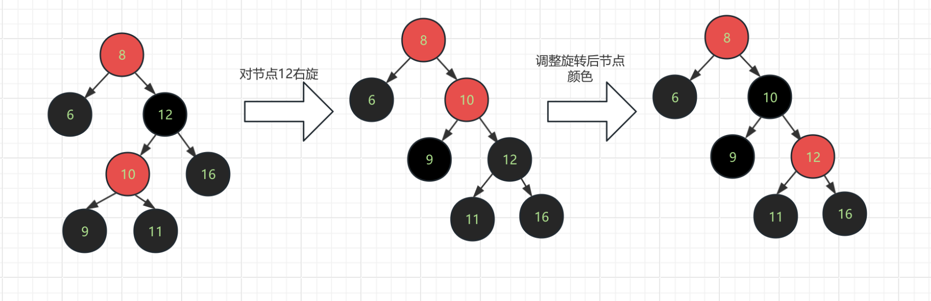
            1. 图中节点10为非同侧红色子节点（确定颜色的有：黑6，黑12，黑16(红色情况在上面已经讨论过了，所以这边是黑色的情况)，
               红10，黑9，黑11）。
                1. 对黑12进行右旋
                2. 旋转前黑12到黑9路径上有两个黑，黑12到黑16路径上有两个黑。
                3. 旋转后，新根节点红10到黑9路径上只有一个黑，所以将根红10改为黑
                4. 新根10到黑16路径上变为三个黑节点，比调整前多了一个，于是再将黑12改为红
                5. 于是发现右旋并且调整颜色之后，图形变成了**兄弟节点同侧的子节点为红色**的情况,所以可以再次重复操作
2. 兄弟节点是红色
    1. 
    2. 该情况下，确定颜色的有，红12，黑8（因为子节点12红色），黑6（双重黑），黑10（父节点12为红），黑16（父节点12为红）
    3. 对根节点黑8进行右旋转 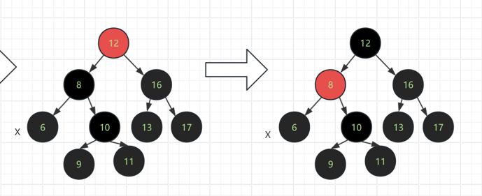
    4. 旋转前原根8右子树有3个黑，旋转后少了一个，于是将新根红12变为黑12，此时左树多了一个黑，于是将黑8变为红8（即新根变为黑，原根变为红）
    5. 因为删除调整看父节点，插入调整看祖父节点
     ,可以看出双重黑6的情况又回到了兄弟节点为黑色，于是将红8作为根节点，重复上述各种情况即可。
   